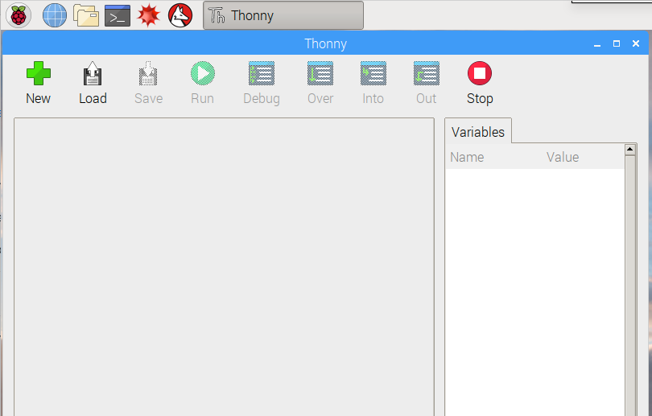
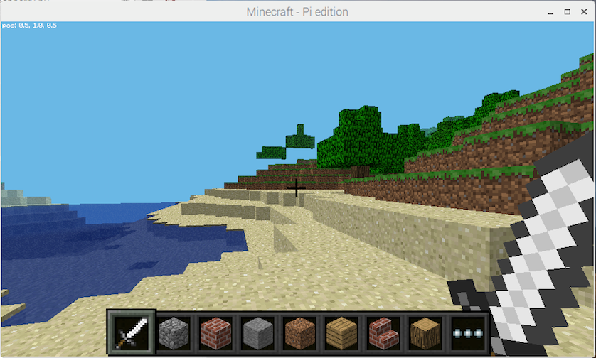

# Setup Instructions {#top}

This page will help guide you through the preparations you need in order to start the worksheet.



## Power up your Raspberry Pi {#powerup} <a href="#top" title="Take me to the top of page"><i class="fa fa-chevron-circle-up" aria-hidden="true"></i></a>

You'll need a Raspberry Pi in order to do these exercises.  The following models should be supported:

- Raspberry Pi Model B+
- Raspberry Pi 2 Model B
- Raspberry Pi 3 Model B
- Raspberry Pi 3 Model B+
- Raspberry Pi Zero
- Raspberry Pi Zero W

Most Pi's ship with the [Raspbian](https://www.raspberrypi.org/downloads/raspbian/) operating system installed, but you can use something like the [New Out Of Box Software (NOOBS)](https://www.raspberrypi.org/downloads/noobs/) installer to get going.  If you're attending this class through the Bonner Springs City Library, the provided Pi's are ready to go!  😎

## Launching Thonny {#launching} <a href="#top" title="Take me to the top of page"><i class="fa fa-chevron-circle-up" aria-hidden="true"></i></a>

We're going to be using a special program called an IDE (Integrated Development Environment) to help us write our Python code.  The Raspberry Pi has a simple and effective one built right in called **Thonny**.  Go ahead and launch it by clicking the  icon in the upper-left corner of your screen and selecting _Thonny (Simple Mode)_ from the _Programming_ menu.

You should have a window like below--go ahead and size it so it is on the left-hand side of your screen:

## Saving a file {#saving} <a href="#top" title="Take me to the top of page"><i class="fa fa-chevron-circle-up" aria-hidden="true"></i></a>

With the window open, we're almost ready to write code!  We just have to have a file to put our code in!

Follow the steps listed below to setup your file:

- Click the `New` button in the top of the Thonny Window
- Then click the `Save` button to bring up a file dialog
- In the _File name_ area, type: `BSCL-LTC1`
- Click the `Save` button in the dialog to save your file to the Pi.


Everytime you run your code in Thonny, it will automatically save the file for you.


## Launching Minecraft {#minecraft} <a href="#top" title="Take me to the top of page"><i class="fa fa-chevron-circle-up" aria-hidden="true"></i></a>

The last step is to get Minecraft launched.  Click the  icon again and this time select _Games_->_Minecraft_.  Position your Minecraft window to the right-hand side of your Thonny window so we can have both visible.

Next, follow the steps below to get your Minecraft world up and running:

- Click the `Start Game` button.
- Select `Create New` to create a new Minecraft World.

When successful, you should see a Minecraft world with your player awaiting some action:

 


Consult the [Resources](/resources.md) section for information about Minecraft and keyboard shortcuts.  You'll want to review that before you go much further.


Alright, we're ready to write some code.  Proceed to the [Connecting to Minecraft](../ws1-connecting/README.md) section to continue!

