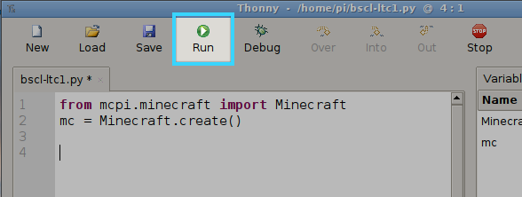
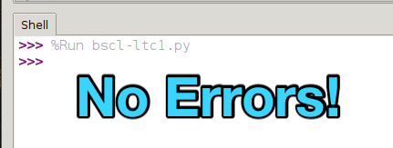

<div>
    
</div>

## Setting up the Connection to Minecraft {#connecting}

Now we need to get Python connected to our Minecraft: Pi Edition instance so we can start applying some of what we've learned to our Minecraft World!

At the top of your Python file inside of Thonny IDE, we need to bring in what is called a library in order to interface with Minecraft.  In programming, "libraries" are code that can be reused to build other programs.  We won't worry too much about these right now.

Type the following into the top of your file:

```python
from mcpi.minecraft import Minecraft
mc = Minecraft.create()
```

Once you've got that in, go ahead and Run your code:



You should see no errors reported in your Shell window below:

<div class="emote-host"><span class="emote"></span></div><div style="clear:both;"></div><br>


Run into a problem?  Make sure that you've launched Minecraft: Pi Edition and that you've started the game.  Reach out to a mentor if you're still seeing errors!


