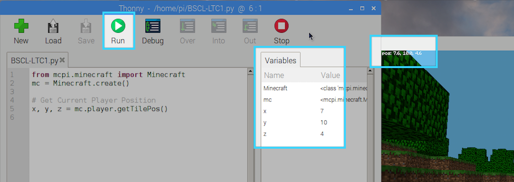

# Working with Variables {#top}

Now that we've got our connection to Minecraft setup, we can start using some of the available functions from that library and begin practicing working with variables!



## Getting Our Position {#position} <span class="navigate-top"><a href="#top" title="Take me to the top of page"><i class="fa fa-chevron-circle-up" aria-hidden="true"></i></a></span>

Let's start by using variables to store the position of our Minecraft character.  Our pixelated friend lives in a three-dimensional coordinate space, which is fancy-speak for saying he has an `X`, `Y`, and `Z` position in the game world.


The slides touched on the fact that the `>>>` or `...` indicates the Python REPL prompt.  This is the "Shell" area in the lower half of your Thonny IDE.  In this worksheet, we'll clearly mark code that you are to put into your Python file (it won't have the REPL prompt) versus things you can try out in the Shell.


We've seen in the slides that we can assign variables with the assignment operator like such:

```python
>>> x = 0
>>> y = 10
>>> z = 20
```

We can also assign variables in one line like so:

```python
>>> x, y, z = 0, 10, 20
>>> x
0
>>> y
10
>>> z
20
>>>
```


You can type these examples directly into the Shell area at the bottom of your Thonny window if you'd like to experiment.



If you right-click in Thonny and select `Clear Shell`, it will reset everything so you have a clean slate.  Don't worry though, it won't delete your code file.


We are going to use this with a Minecraft function to retrieve our players position.  Type the following code into your `BSCL-LTC1.py` file in your Thonny IDE (after your Minecraft connection lines):

```python
x, y, z = mc.player.getTilePos()
```

Now, if you click _Run_, you should see the values in your variables list on the right matching up with what Minecraft is showing.

<div class="emote-host"><span class="emote"></span></div><div style="clear:both;"></div><br>

## Laying some groundwork {#groundwork} <span class="navigate-top"><a href="#top" title="Take me to the top of page"><i class="fa fa-chevron-circle-up" aria-hidden="true"></i></a></span>

Next, let's collect a couple other variables that we'll need to work with.  There are many different block types in Minecraft and each one has a specific number association.  Let's hold onto a few important ones by capturing them into variables.  Add the following to your file:

```python
# Block Definitions
water = 8
lava = 10
air = 0
yellow_flower = 37
```


While you can omit the comments above, it is good programming practice to comment your code so that others can understand it!  


Your code should look something like this now:

```python
from mcpi.minecraft import Minecraft
mc = Minecraft.create()

# Block Definitions
water = 8
lava = 10
air = 0
yellow_flower = 37

# Get Current Tile under Player
x, y, z = mc.player.getTilePos()
```

Okay, let's move to the next section where we're going to start interacting with our Minecraft world!