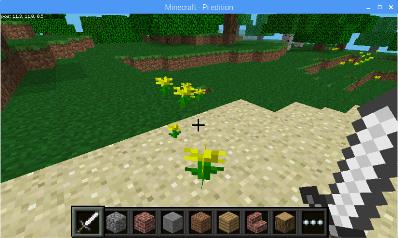

# Loops and Conditionals {#top}

Now that we've got some foundation out of the way, let's start turning up the dial!  It is time to apply some control structures such as `if` statements and `while` loops.



## Setting up our Program Loop {#mainloop} <span class="navigate-top"><a href="#top" title="Take me to the top of page"><i class="fa fa-chevron-circle-up" aria-hidden="true"></i></a></span>

Some programs accept some input and produce some output.  When run, these programs do their job and then exit.  Other programs run on the computer and are constantly processing.  These types of programs require what we call a main loop.  We'll put a simple one in place with a very simple `while` loop.  

Add the while loop before the current player position gathering:

```python
while True:
    x, y, z = mc.player.getTilePos()
```


Indentation is very important in Python.  Note that anything that is indented within a control structure is what is considered within the "scope" of that structure.  In other words, everything that is indented will be _in_ our `while` loop.


## Fun with Expressions {#expressions} <span class="navigate-top"><a href="#top" title="Take me to the top of page"><i class="fa fa-chevron-circle-up" aria-hidden="true"></i></a></span>

Let's enhance this a bit further by using some expressions to help us determine if the player has moved to a new tile position.  We'll store the result of this in a special variable we can use to do something when the player moves from one tile to another.

Add the new lines of code below to your project:

```python
from mcpi.minecraft import Minecraft
mc = Minecraft.create()

# Block Definitions
water = 8
lava = 10
air = 0
yellow_flower = 37

# Get the initial tile position of the player
last_x, last_y, last_z = mc.player.getTilePos()

while True:
    # Get the current tile position of the player
    x, y, z = mc.player.getTilePos()

    # Capture if the player has moved
    player_moved = last_x != x or last_y != y or last_z != z

    # Output when the player has moved
    if player_moved:
        print("Player has moved to a new tile")

    # Sync up the last and current positions
    last_x, last_y, last_z = x, y, z
```

Okay, we've got a bit to unpack.  Let's review some of what we've put in above:

- Prior to our loop we "initialize" our variables to track the last known position of the player.  We'll use these to compare to the current position.
- The `player_moved` variable is assigned the result of an expression that will be `True` if either `x`, `y`, or `z` doesn't match the last known positions.
- We then print some output to our _Shell_ when `player_moved` is `True` so we know when our expression is working.
- Finally, we make the last known values equal to the current values.  If the player doesn't move, then they'll continue to be the same.

Go ahead and _Run_ this code and then move your player around.  You'll see output in the "Shell" area when you move to a new tile.


Since we now have a loop that never ends, you'll need to use the `Stop` button to interrupt your code.  It will print some scary stuff in the _Shell_ section, but that is normal, don't worry. 😀


## Planting Flowers {#flowers} <span class="navigate-top"><a href="#top" title="Take me to the top of page"><i class="fa fa-chevron-circle-up" aria-hidden="true"></i></a></span>

Now that we can do something when our player moves, let's use this fantastic progress to have some fun.  Add to your `if` clause at the end of our program like shown below:

```python
if player_moved:
    print("Player has moved to a new tile")
    mc.setBlock(last_x, last_y, last_z, yellow_flower)
```

Run your program and then walk around in your Minecraft world.  **Then turn around!**

<div class="emote-host"><span class="emote"></span></div><div style="clear:both;"></div><br>

Wherever you walk now while your program is running, you'll see flowers behind you!  Everytime the program detects that our player has moved to a new tile, we place a yellow flower on it!


Try and experiment with some different block types by substituting `yellow_flower` with some other block types like `38`, `39`, or `40`.  Check out [Resources](/resources.md) for a link to the Minecraft API reference for more information on available block types.


## Creating Water {#water} <span class="navigate-top"><a href="#top" title="Take me to the top of page"><i class="fa fa-chevron-circle-up" aria-hidden="true"></i></a></span>

So far, we've used `if` statements and a `while` loop.  How about we use a `for` loop next!  We can make use of another neat feature of the Minecraft API called block events.  These allow our program to discover information about a block that is _hit_ within Minecraft (via the right-click when using your _Sword_ in the game).  To set this up, we'll need to gather the block events first and use a `for` loop to run code against each block event.  After our `if` statement, lets put in some code to get this done:

```python
# Gather Block Events
block_events = mc.events.pollBlockHits()
for block_event in block_events:
    print("Hit a block!")
```

<!-- TODO: Would like to have more content about `for` loops here -->

If you _Run_ your code and, in Minecraft, point your player at a block (the ground is fine) and right-click, you should see your sword swing and you ought to see `Hit a block!` print out in your _Shell_ in Thonny.  Now we know our block event gathering is working!  Lets build a little further and capture a few variables about our block hit by adding to our `for` block:

```python
    # Retrieve hit position from the block event
    hit_x, hit_y, hit_z = block_event.pos
```

Alright, now we're getting somewhere.  Time for some fun.  Add the following line to the end of your `for` block:

```python
    mc.setBlock(hit_x, hit_y, hit_z, water)
```

----

Okay, that is it for _Part I_.  If you've still got time left before _Part II_ slides, feel free to experiment with your program a little and have fun with what you've created, you've earned it!


For some real excitement, try this line in place of the above: 
```python
mc.setBlock(hit_x, hit_y, hit_z, 46, 1)
```
Now try to destroy that block via left-clicking while pointing at it in the game. _Oh, and you might run when the block starts blinking._ 🤣
